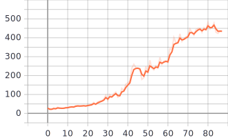

A very simple implementation of the PPO algorithm.\
It currently does not support multi-process experiance collection.

As a sanity check I ran it on CartPole-v1 env from gym.\
The implementation reached 400 reward averaged over 20 trials in ~70 epochs.

